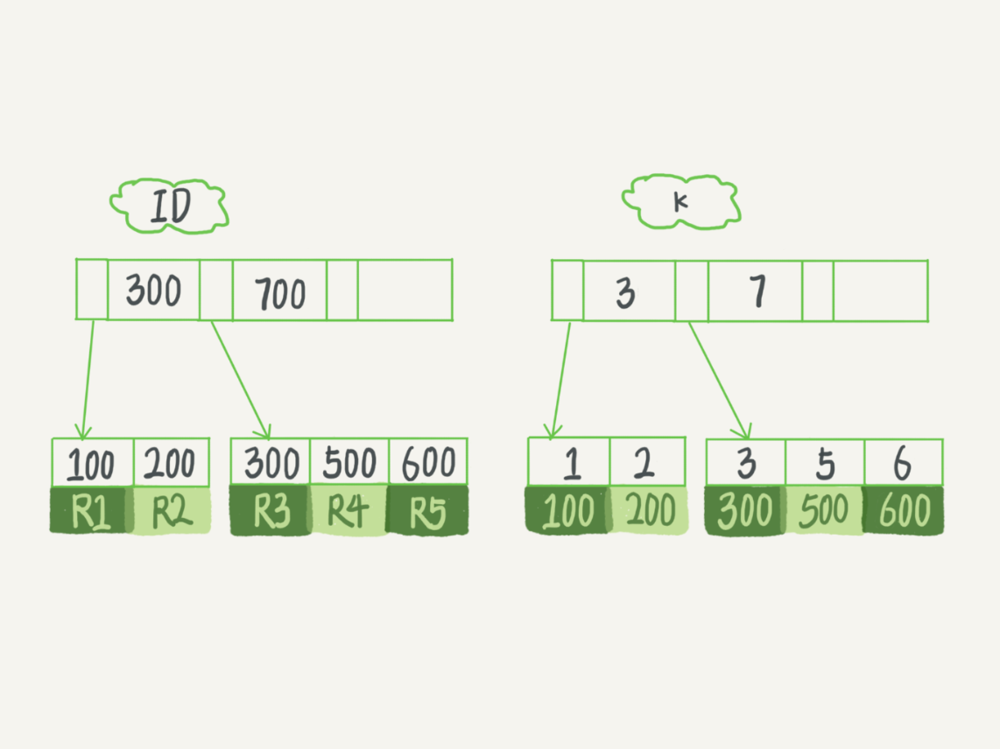

 [toc]

## 09 | 普通索引和唯一索引，怎么选择？

-   今天，我们就继续来谈谈，在不同业务场景下，应该选择普通索引，还是唯一索引？

-   示例：

    -   按照身份证查姓名

        ```mysql
        
        select name from CUser where id_card = 'xxxxxxxyyyyyyzzzzz';
        ```

-   从性能角度考虑，选择唯一索引还是普通索引？依据是什么呢？

-   回顾：InnoDB 的索引组织结构

    -   

### 查询

-   例

    -   ```mysql
        select id from T where k=5。
        ```

    -   对于**普通索引**来说，查找到满足条件的第一条记录（5，500）后，需要查找下一个记录，直到碰到第一个不满足 k=5 条件的记录。

    -   对于**唯一索引**来说，由于索引定义了唯一性，查找到第一个满足条件的记录后，就会停止继续检索。

-   不同索引带来的性能差距会有多少呢？答案是：**微乎其微**。

    -   InnoDB 的数据是按数据页为单位来读写的。也就是说，当需要读一条记录的时候，并不是将这个记录本身从磁盘读出来，而是以页为单位，将其整体读入内存。InnoDB 中，每个页的大小默认是 16 KB。
    -   对于普通索引来说，要多做那一个“查找和判断下一条记录”的操作，就只需要一次指针寻找和计算。
    -   如果 k=5 记录刚好是这个数据页的最后一个记录，那么要取下一个记录，必须读取下一个数据页，这个操作会稍微复杂一些。（这种情况的概率会很低。对于整型字段，一个数据页可以放近千个 key。）

### 更新

-   为了说明普通索引和唯一索引对更新语句性能的影响这个问题，我需要先跟你介绍下 change buffer。

#### change buffer

-   当需要更新一个数据页时，如果数据页在内在中就直接更新，而如果这个数据页还没有在内存中的话，在不影响数据一致性的前提下，InnoDB 会将这些更新操作缓存在 change buffer 中，这样就不需要从磁盘中读入这个数据页了。
-   在下次查询需要访问这个数据页的时候，将数据读入内存，然后执行 change buffer 中与这个页有关的操作。
-   通过上面这个方式就能保证这个数据逻辑的正确性。
-   change buffer 是**可以持久化的数据**。也就是说，change buffer 在内存中有拷贝，也会被写入到磁盘上。
-   将 change buffer 中的操作应用到原数据页，得到最新结果的过程称为 **merge**。除了访问这个数据页会触发 merge 外，系统有后台线程会定期 merge。在数据库正常关闭（shutdown）的过程中，也会执行 merge 操作。
-   显然，**如果能够将更新操作先记录在 change buffer，减少磁盘，语句的执行速度会得到明显的提升**。而且，数据读入内存是需要占用 buffer pool 的，所以，这种方式还能够避免占用内存，提高内存利用率。

#### 什么条件下可以使用 change buffer 呢？

-   **唯一索引的更新就不能使用 change buffer，只有普通索引可以使用**。

-   对于**唯一索引**，所有更新操作都要先判断操作是否违反唯一性约束。而这必须要将数据页诗篇内存才能判断。如果都已经在内存了，那直接更新内存会更快，就没必须使用 change buffer了。
-   change buffer 用的是 buffer pool 里的内存，因此不能无限增大。可以通过 innodb_change_bufferb_max_size 来设置。

#### 在表中插入一个新记录（4,400），InnoDB 的处理流程是怎样的。

1.  **这个记录要更新的目标页在内存中**。
    -   **唯一索引**，找到 3 和 5 间的位置，判断到没有冲突，插入这个值，语句执行结束。
    -   **普通索引**，找到 3 和 5 间的位置，插入这个值，语句执行结束。
    -   上面两种的差别只有一个判断，只会耗费微小的 CPU 时间。
2.  **这个记录要更新的目标页不在内存中**。
    -   **唯一索引**，将数据页读入内存，判断到没有冲突，插入这个值，语句执行结束。
    -   **普通索引**，将数据记录在 change buffer，语句执行结束。

### change buffer 的使用场景

-   **普通索引的所有场景，使用change buffer 都可以起到加速作用吗**？
-   因为 merge 的时候是真正进行数据更新的时刻，而 change buffer 的主要目的就是将记录的变更动作缓存下来，所以在一个数据页做 merge 前，change buffer 记录的变更越多，收益越大。
-   对于**写多读小**的业务来说，页面在写完以后马上被访问到的概率比较小，此时，change buffer 的使用效果最好。

### 索引选择和实践

-   普通索引和唯一索引在查询能力上没差别，主要考虑的是对更新性能的影响。所以，**建议你尽量选择普通索引**。
-   如果所有更新后面，都马上伴随着这个记录的查询，那么你应该关闭 change buffer。
-   普通索引和 change buffer 的配合使用，对于数据量大的表的更新优化还是很明显的。

### change buffer 和 redo log

-   简单对比两个机制在提升更新性能上的收益：
    -   **redo log 主要节省的是随机写磁盘的 IO 消耗（转成顺序写）。**
    -   **而 change buffer 主要节省的则是随机读磁盘的 IO 消耗**。

### 小结

-   由于唯一索引用不上 change buffer 的优化机制，因此如果业务可以接受，从性能角度出发，我建议你**优先考虑非唯一索引**。

