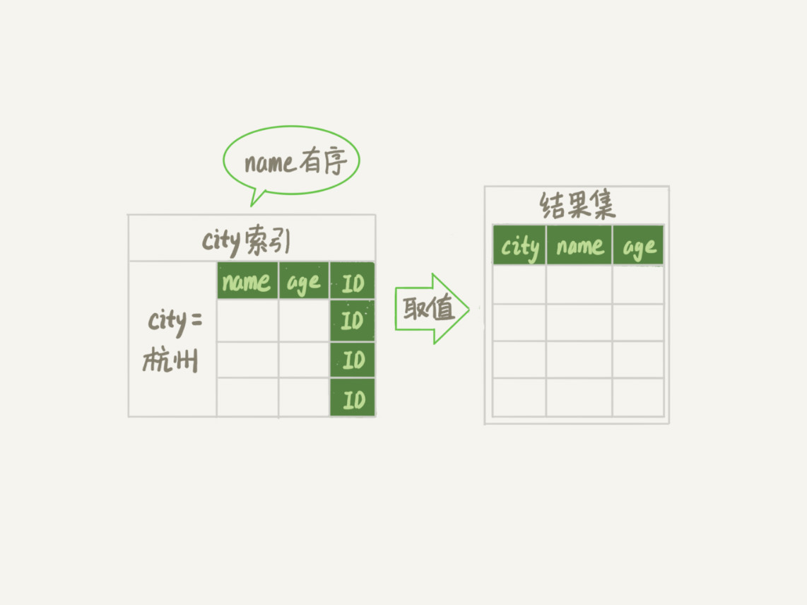

[toc]

## 16 | “order by” 是怎么工作的？

1.  表定义

    -   ```sql
        
        CREATE TABLE `t` (
          `id` int(11) NOT NULL,
          `city` varchar(16) NOT NULL,
          `name` varchar(16) NOT NULL,
          `age` int(11) NOT NULL,
          `addr` varchar(128) DEFAULT NULL,
          PRIMARY KEY (`id`),
          KEY `city` (`city`)
        ) ENGINE=InnoDB;
        ```

2.  SQL 语句

    -   ```sql
        
        select city,name,age from t where city='杭州' order by name limit 1000  ;
        ```

### 全字段排序

1.  为避免全表扫描，我们需要在 city 字段加上索引。

2.  explain 命令

    -   
    -   Extra 中 “Using filesort” 表示，需要排序。
    -   MySQL 会给每个线程分配一块内存用于排序，称为 **sort_buffer**。

3.  查询过程

    -   city 索引示意图

    -   

    -   流程

        >1.  初始化 sort_buffer，确定放入 name、city、age 这三个字段。
        >2.  从索引 city 找到第一个满足 city='杭州' 条件的主键 id，也就是 ID_X。
        >3.  到主键 id 索引取出整行，取 name、city、age 三个字段的值，存入 sort_buffer 中。
        >4.  从索引 city 取下一个记录的主键 id。
        >5.  重复 3、4 直到 city 的值不满足条件为止。
        >6.  对 sort_buffer 中的数据按照字段 name 做快速排序。
        >7.  按照排序结果，取前 1000 行返回给客户端。

    -   流程图：

        -   

4.  上图中，“按 name 排序”，是否在内存中完成，这取决于 **sort_buffer_size** 参数。

    -   sort_buffer_size，就是 MySQL 为排序开辟的内存（sort_buffer）的大小。

### rowid 排序

1.  **如果 MySQL 认为排序的单行长度太大会怎么做呢？**

2.  调整一个参数，让 MySQL 采用另外一种算法。

    -   ```sql
        -- 是 MySQL 中专门控制用于排序的行数据的长度的一个参数
        SET max_length_for_sort_data = 16;
        ```

    -   新的算法放入 sort_buffer 的字段，只有**要排序的列（name）和主键**。

3.  执行过程

    -   流程

        >   1.  初始化 sort_buffer，放入 name 和 id。
        >   2.  从索引 city 找到第一个满足 city='杭州' 条件的主键 id，也就是 ID_X。
        >   3.  到主键 id 索引取出整行，取 name、id 这两个字段，存入 sort_buffer 中。
        >   4.  从索引 city 取下一个记录的主键 id。
        >   5.  重复 3、4 直到 city 的值不满足条件为止。
        >   6.  对 sort_buffer 中的数据按照字段 name 进行排序。
        >   7.  按照排序结果，取前 1000 行，**并按照 id，回原表中取 city、name 和 age 三个字段**返回给客户端。

    -   流程图
        
        -   
        
    -   **对比 “全字段排序” 流程图，rowid 排序多访问了一次表 t 的主键索引，就是步骤 7**。

### 优化

1.  如果从 city 索引上取出来的行，天然就是有序的，是不是就可以不用排序？

    -   确实


#### 创建联合索引

1.  **为 city 和 name 创建联合索引**

    -   ```sql
        
        alter table t add index city_user(city, name);
        ```

    -   索引图

        -   

    -   这样，只要 city 的值是 杭州，name 的值就一定有序。

2.  查询过程

    -   流程

        >1.  从索引（city，name）找到第一个满足 city='杭州' 条件的主键 id。
        >2.  到主键 id 索引取出整行，取 name、city、age 三个字段。
        >3.  从索引（city，name）取下一个记录主键 id。
        >4.  重复步骤 2、3，直到查到第 1000 条记录，或不满足 city='杭州' 条件时，循环结束。

    -   流程图

        -   

    -   **可以看出，这个查询过程不需要临时表，也不需要排序。**

3.  explain

    -   
    -   Extra 字段中没有 Using filesort 了，也就不需要排序了。
    -   由于（city，name）这个联合索引本身有序，所以，就不用把 4000 行全读一遍，只要找满足条件的前 1000 条记录就可以退出了。

#### 覆盖索引

1.  **覆盖索引是指，索引上的信息足够查询请求，不需要再回到主键索引上去取数据。**

2.  创建 （city，name，age）联合索引。

    -   ```sql
        
        alter table t add index city_user_age(city, name, age);
        ```

3.  查询过程

    -   流程

        >   1.  从索引（city,name,age）找到第一个满足 city='杭州' 条件的记录，取其中的 city、name 和 age 三个字段的值。
        >   2.  从索引（city,name,age）取下一个记录。
        >   3.  重复执行 2，直到查到第 1000 条记录，或不满足 city='杭州' 条件时，循环结果。

    -   流程图

        -   

4.  explain

    -   
    -   Extra 字段里面多个 “Using index”，表示就是使用了覆盖索引，性能会快很多。

### 小结

1.  使用 order by 语句时，需要心里清楚每个语句的排序逻辑是怎么实现的，还要能够分析出最坏情况下，每个语句的执行对系统资源的消耗。这样才能做到下笔如有神。

