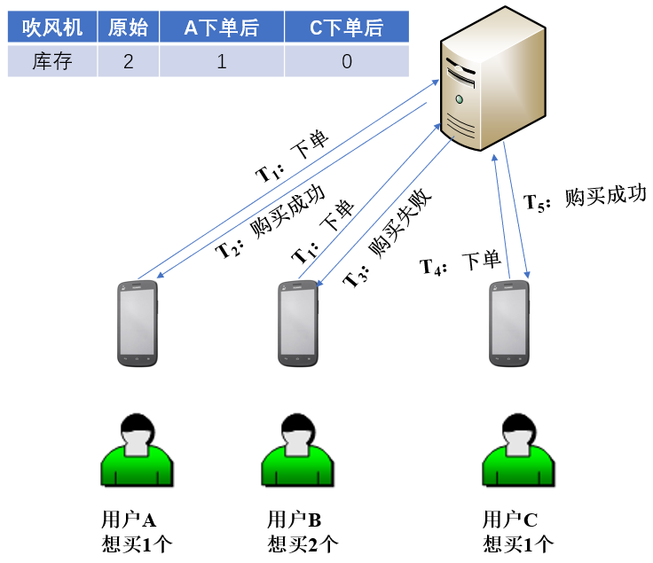
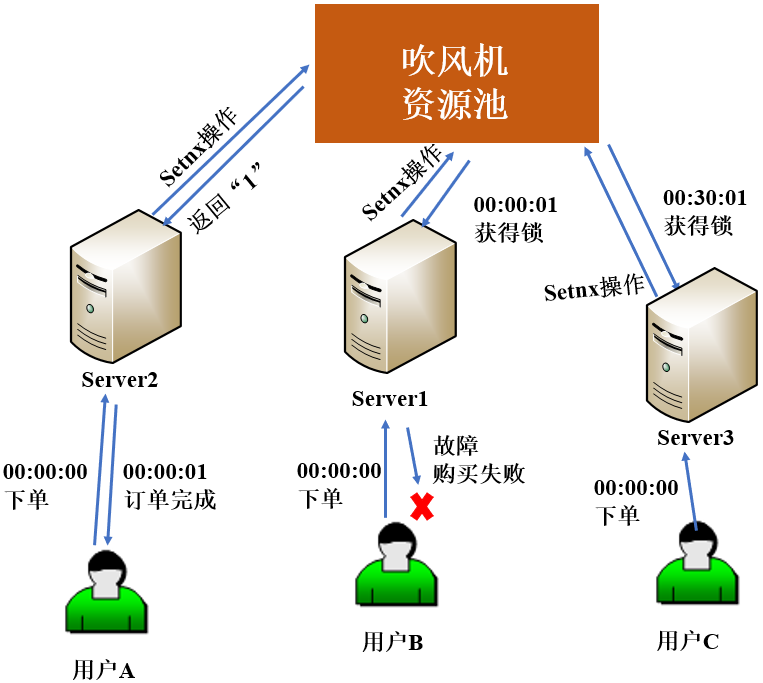
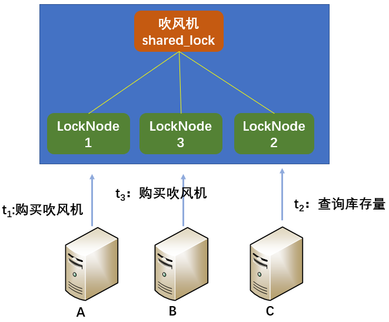
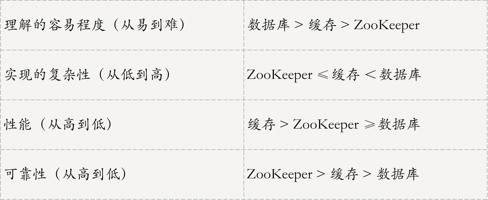

[TOC]

## 07 | 分布式锁：关键重地，非请勿入

### 为什么要使用分布式锁？

-   **为了维护数据的一致性**，我们需要某种机制来保证只有满足某个条件的线程才能访问资源，不满足条件的线程只能等待，在下一轮竞争中重新满足条件时才能访问资源。
-   为了实现分布式互斥，在某个地方做个**标记**，这个标记每个线程都能看到，到标记不存在时可以设置该标记，当标记被设置后，其他线程只能等待拥有该标记的线程执行完成，并释放该标记后，才能去设置该标记和访问共享资源。这里的标记，就是我们常说的**锁**。
-   **锁是实现多线程同时访问同一共享资源，保证同一时刻只有一个线程可访问共享资源所做的一种标记。**
-   **分布式锁**是指分布式环境下，系统部署在多个机器中，实现多进程分布式互斥的一种锁。

### 分布式锁的三种实现方法及对比

-   实现分布式锁的3种主流方法：
    1.  基于数据库实现分布式锁，这里的数据库指的是关系型数据库。
    2.  基于缓存实现分布式锁。
    3.  基于Zookeeper 实现分布式锁。

#### 基于数据库实现分布式锁

-   最直接的方式就是创建一张锁表，然后通过操作该表中的数据来实现。
-   当我们要锁住某个资源时，就在表中加一条记录，想要释放的时候就删除一条记录。**数据库对共享资源做了唯一性约束，如果有多个请求被同时提交到数据库的话，数据库会保证只有一个操作可以成功**。操作成功的线程获取资源的锁。
-   特点：
    -   基于数据库实现的分布式锁，最容易理解。
    -   数据库需要落地到硬盘上，频繁读取数据库会导致 IO 开销大。
-   适用场景
    -   **适用于并发量低，对性能要求低的场景**。
-   电商案例图
    -   
-   可以看出，**基于数据加实现分布式锁比较简易，绝招在于创建一张锁表，为申请者在锁表里建立一条记录，记录建立成功则获得锁，消除记录则释放锁**。
-   主要的两个缺点：
    -   单点故障问题
    -   死锁问题

#### 基于缓存实现分布式锁

-   **基于缓存，也就是说把数据存放在计算机内存中，不需要写入磁盘，减少了 IO 读写。**

-   下面，用 Redis 的 setnx(key, value) 函数来实现分布式锁。

-   key 表示锁 id，value = currentTime + timeOut,

-   setnx 函数的返回值有 0 和 1：
    -   返回 1，说明该服务器获得锁。
    -   返回 0，说明其他服务器已经获得了锁，进程不能进入临界区。

-   电商案例图：
    
    -   
    
-   小结：
    
    -   **Redis 通过队列来维持进程访问共享资源的先后顺序**。
    
-   相较于数据库实现分布式锁的方案来说，**基于缓存实现的分布式锁的优势**在于：
    -   性能更好。
    -   很多缓存可以跨集群部署，避免了单点故障问题。
    -   可以设置超时时间来控制锁的释放。
    
-   不足：
    
    -   通过超时时间来控制锁的失效时间，并不是十分靠谱。
    
-   redis 分布式锁实现代码：

    -   ```python
        
        import redis
        
        
        class RedisLock:
        
            def __init__(self, lock_key, expire_time=30):
        		
                # 这个根据场景，配置 redis 连接信息
                redis_conf = {}
        
                self.redis = redis.Redis(
                    host=redis_conf.get("HOST"),
                    port=redis_conf.get("PORT"),
                    db=redis_conf.get("DB")
                )
                self.lock_key = lock_key
                self.expire_time = expire_time
        
            def acquire_lock(self):
        
                res = self.redis.setnx(self.lock_key, 1)
                if res:
                    # 设置超时时间，避免死锁
                    self.redis.expire(self.lock_key, self.expire_time)
                    return True
        
                else:
                    return False
        
            def release_lock(self):
                # 优化 expire 带来的弊端，及时释放锁
                self.redis.delete(self.lock_key)
        
            def __enter__(self):
                return self.acquire_lock()
        
            def __exit__(self, exc_type, exc_val, exc_tb):
                self.release_lock()
        
        
        if __name__ == "__main__":
        
            with RedisLock("foo") as lock:
                if lock:
                    print("Successful lock acquisition")
                    print("Doing some thing ...")
        
        ```

#### 基于Zookeeper 实现分布式锁

-   ZooKeeper 4 种节点构成：
    -   持久节点
    -   持久顺序节点
    -   临时节点
    -   临时顺序节点
-   根据它们的特征，**ZooKeeper 基于临时顺序节点实现了分布式锁**。
-   ZooKeeper 会采用如下方法来实现分布式锁：
    1.  在与该方法对应的持久节点 shared_lock 的目录下，为每个进程创建一个临时顺序节点。
    2.  每个进程获取 shared_lock 目录下的所有临时节点列表，注册子节点变更的 Watcher，并监听节点。
    3.  每个节点确定自己的编号是否 shared_lock 下所有子节点中最小的，若最小，则获得锁。
    4.  若本进程对应的临时节点编号不是最小的，则分为两种情况：
        -   本进程为读请求，如果比自己序号小的节点中有写请求，则等待。
        -   本进程为写请求，如果比自己序号小的节点中有读请求，则等待。
-   案例图：
    -   
-   可以看到，使用ZooKeeper 可以完美解决设计分布式锁遇到的各种问题，如单点、不可重入、死锁等问题。

#### 三种实现方式对比

-   
-   小结：
    -   **ZooKeeper 分布式锁的可靠性最高，在封装好的框架，很容易实现分布式锁的功能，并且几乎解决了数据库和缓存式锁的不足，因此是实现分布式锁的首选方法。**
-   为确保分布式锁的可用性，我们在设计时应考虑以下问题：
    -   互斥性
    -   死锁
    -   可重入性
    -   性能

### 扩展：如何解决分布式锁的羊群效应问题？

-   在分布式锁中，会常常遇到羊群效应。
-   所谓羊群效应，就是在整个分布式锁的竞争过程中，大量的 Watcher 通过和子节点列表的获取操作重复运行。且大多数节点的运行结果都是判断出自己当前不是编号最小的节点，继续等待下一次通知，而不是业务逻辑。
-   **如果解决这个问题呢**？具体方法可以分为以下三步：
    1.  在与该方法对应的持久节点的目录下，为每个进程创建一个临时顺序节点。
    2.  每个进程获取所有临时节点列表，对比自己的编号是否最小，若最小，则获得锁。
    3.  若本进程对应的临时节点编号不是最小，则继续判断。
        -   若本进程为读请求，则向比自己序号小的最后一个写请求节点注册watch 监听，当监听到该节点释放锁后，则获取锁。
        -   若本进程为写请求，则向比自己序号小的最后一个请求节点注册watch 监听，当监听到该节点释放锁后，获取锁。

### 总结

-   今天，我们介绍了三种实现分布式锁的方法，包括：
    -   基于数据库实现
    -   基于缓存实现（redis）
    -   基于 Zookeeper 实现

-   思维导图
    -   