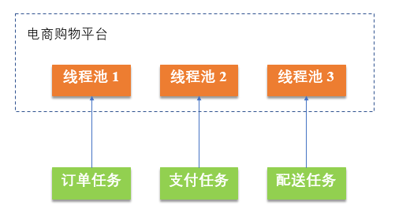
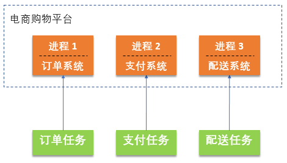
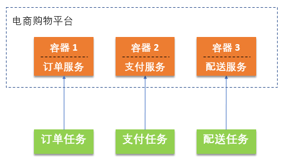

[toc]

## 30 | 分布式高可用之故障隔离

1.  今天，我们一起打卡分布式高可用中的**故障隔离**。

### 什么是故障隔离？

1.  **把故障通过某种方式与其他正常模块进行隔离**，以保证某一模块出现故障后，不会影响其他模块。
2.  今天，我与你介绍故障隔离策略，**是整个系统设计时，从高可用这个维度进行设计和策略**。

### 分布式故障隔离策略

-   大体可以从两个维度来划分：
    1.  一类是，**以系统功能模块为粒度进行隔离**。
    2.  另一类是，通过**资源隔离**来实现。

#### 线程级隔离

1.  使用**不同线程池**处理不同请求任务。
    -   
2.  线程间的通信常使用**共享变量**来实现。

#### 进程级隔离

1.  一种常用的方式是，**将系统按照功能分为不同的进程**，分布到相同或不同的机器中。
    -   
2.  实现进程级隔离后，进程间的协同必须通过**进程间通信（IPC）**来实现。进程间通信方式，大体可以分为两类：
    -   进程在**同一台机器上**，则可以通过管道、消息队列、信号量、共享内在等方式来实现。
    -   进程分布在**不同机器上**，则可以通过远程调用来实现。

#### 资源隔离

1.  资源隔离就是**将分布式系统的所有资源分成几个部分**，每个部分负责一个模块。
2.  **微服务**就是一个典型的例子。
    -   在微服务中，**一个服务通常对应一个容器**，而一个容器其实就是操作系统中一个进程，不同容器负责不同的服务。
    -   
3.  微服务与进程级别隔离不同的是，**微服务框架采用容器进行故障隔离**。与进程不同的是：、
    -   **容器可以实现资源限制**，让每个容器占用资源都有一个上限。

### 故障隔离策略综合对比

-   

### 扩展：从用户角度看，有哪些常用的故障隔离方案？

1.  前面我们讲的都是一种针对**服务方**的故障隔离手段。
2.  还有一种故障隔离策略是针对用户的，及**用户级别的故障隔离**。
    -   是指，将不同用户分开，当系统出现故障时，只影响部分用户，而不是全体用户。
    -   “灰度发布”

### 总结

1.  首先，我们了解了**故障隔离的概念**，并引出分布式系统中的故障隔离。
    -   分布式系统中的故障隔离技术是，在进行分布式系统可用性设计时，考虑故障隔离的设计，也就是提前预防或避免出现故障后对整个系统造成影响。
2.  然后，介绍了常见的**故障隔离策略**。
3.  思维导图：
    -   

