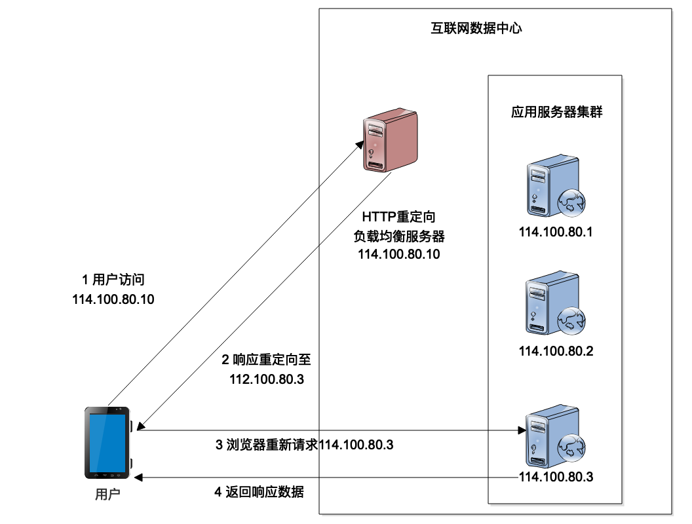
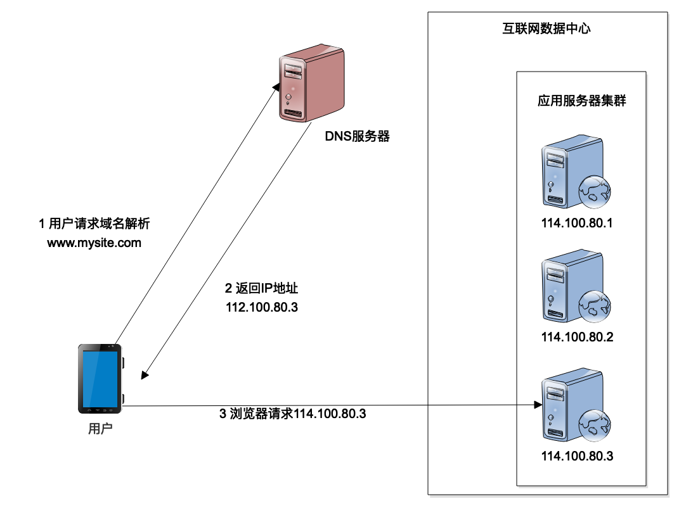
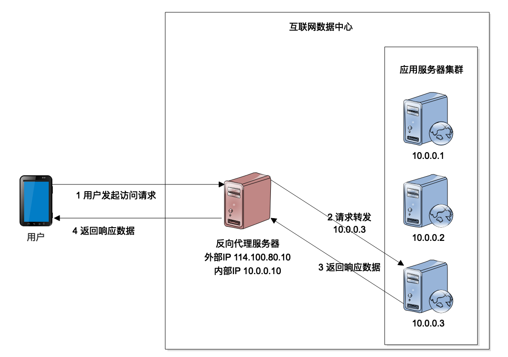
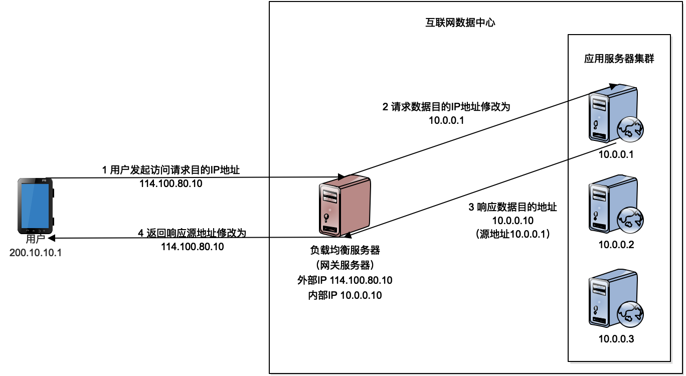
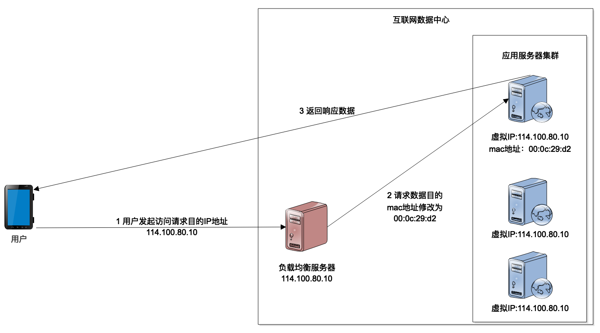

[toc]

## 24 | 负载均衡架构：如何用 10 行代码实现一个负载均衡服务？

1.  负载均衡是如何实现的？
2.  实现负载均衡的技术方案。

### HTTP 重写向负载均衡

1.  架构图
    -   
2.  优点：
    -   设计简单
3.  缺点：
    -   一方面是，用户**完成一次访问，需要请求两次**数据中心，一次请求负载均衡服务器，一次请求应用服务器。
    -   另一方面是，需要把应用服务器的 IP 地址暴露给外部用户，这样就带来的**安全性**问题。

### DNS 负载均衡

1.  架构图
    -   
2.  特点：
    -   一次解析后，域名缓存在本机，因此性能方面不会是问题。
    -   大型互联网应用需要两次负载均衡，一次通过 DNS 负载均衡，然后再进行一次负载均衡。这样应用服务器不需要暴露公网 IP。

### 反向代码负载均衡

1.  架构图
    -   
2.  工作在 **HTTP 协议层**之上。
3.  特点：
    -   比较重，效率比较低，常用在小规模的互联网系统上。

### IP 负载均衡

1.  架构图
    -   

2.  工作在 **TCP/IP 协议的 IP 层**（网络层）进行负载均衡。
3.  原理
    -   当用户请求到达负载均衡服务器后，负载均衡服务器会对网络层的数据包的 IP 地址进行转换，修改 IP 地址，将其修改为应用服务器的 IP 地址，然后把数据包重新发送出去，请求数据会到达应用服务器。
4.  特点：
    -   在**操作系统内核直接修改 IP 数据包的地址**。

### 数据链路层负载均衡

1.  构架图：
    -   
2.  原理
    -   通过修改数据链路层里的网卡 mac 地址，在数据链路层实现负载均衡。
3.  特点
    -   避免响应数据再经过负载均衡服务器，因而可以承受较大的数据传输压力。所以，目前大型互联网应用基本都使用链路层负载均衡。
4.  相关技术
    -   LVS

### 小结

1.  本节主要描述的是负载均衡的**网络技术架构**。
2.  此外，还需要关注负载均衡的**算法**。
    -   主要的负载均衡算法有轮询、随机、最小连接几种。

