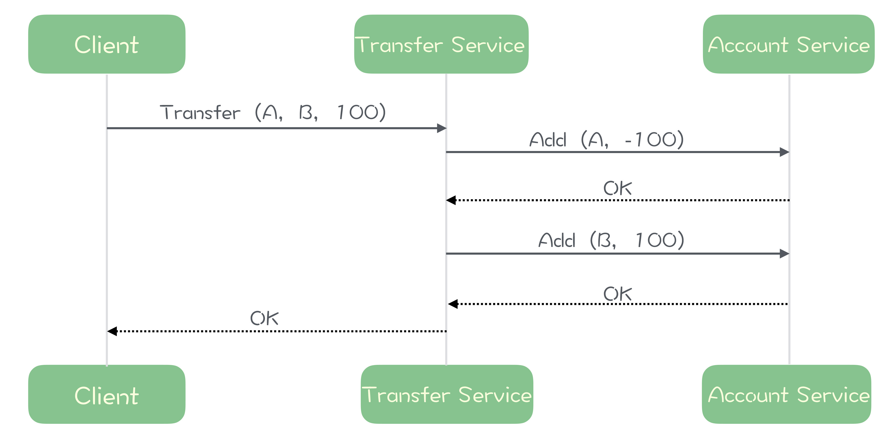
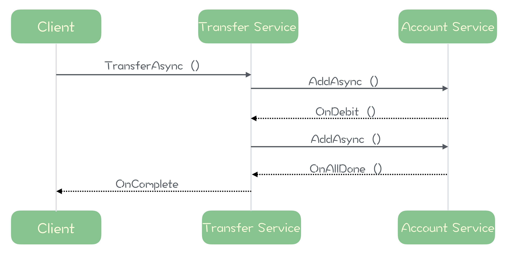

[toc]

## 10 | 如何使用异步设计提升系统性能？

### 异步设计如何提升系统性能

1.  转账微服务时序图
    -   

#### 1. 同步实现的性能瓶颈

1.  伪代码

    -   ```java
        
        Transfer(accountFrom, accountTo, amount) {
          // 先从accountFrom的账户中减去相应的钱数
          Add(accountFrom, -1 * amount)
          // 再把减去的钱数加到accountTo的账户中
          Add(accountTo, amount)
          return OK
        }
        ```

2.  如果请求速度过快，那么请求就不能被马上处理，只能阻塞或排队。这时，服务的响应时延就会延长到了：**排队等待时延 + 处理时延**。

3.  **采用同步实现，整个服务器的所有线程大部分时间都没有在工作，而是都在等待**。

#### 2. 异步解决等待问题

1.  伪代码

    -   ```java
        
        TransferAsync(accountFrom, accountTo, amount, OnComplete()) {
          // 异步从accountFrom的账户中减去相应的钱数，然后调用OnDebit方法。
          AddAsync(accountFrom, -1 * amount, OnDebit(accountTo, amount, OnAllDone(OnComplete())))
        }
        // 扣减账户accountFrom完成后调用
        OnDebit(accountTo, amount, OnAllDone(OnComplete())) {
          //  再异步把减去的钱数加到accountTo的账户中，然后执行OnAllDone方法
          AddAsync(accountTo, amount, OnAllDone(OnComplete()))
        }
        // 转入账户accountTo完成后调用
        OnAllDone(OnComplete()) {
          OnComplete()
        }
        ```

2.  时序图

    -   

3.  异步线程模型由同步顺序调用改为了**异步调用和回调机制**。

### 异步框架：CompletableFuture

1.  Java 中比较常用的异步框架有 Java8 内置的 CompletableFuture 和 ReactiveX 的 RxJava。

2.  用 CompletableFuture 实现转账服务。

    -   ```java
        
        /**
         * 账户服务
         */
        public interface AccountService {
            /**
             * 变更账户金额
             * @param account 账户ID
             * @param amount 增加的金额，负值为减少
             */
            CompletableFuture<Void> add(int account, int amount);
        }
        
        
        
        /**
         * 转账服务
         */
        public interface TransferService {
            /**
             * 异步转账服务
             * @param fromAccount 转出账户
             * @param toAccount 转入账户
             * @param amount 转账金额，单位分
             */
            CompletableFuture<Void> transfer(int fromAccount, int toAccount, int amount);
        }
        
        
        
        /**
         * 转账服务的实现
         */
        public class TransferServiceImpl implements TransferService {
            @Inject
            private  AccountService accountService; // 使用依赖注入获取账户服务的实例
            @Override
            public CompletableFuture<Void> transfer(int fromAccount, int toAccount, int amount) {
              // 异步调用add方法从fromAccount扣减相应金额
              return accountService.add(fromAccount, -1 * amount)
              // 然后调用add方法给toAccount增加相应金额
              .thenCompose(v -> accountService.add(toAccount, amount));    
            }
        }
        
        
        
        /**
         * 客户端使用
         */
        public class Client {
            @Inject
            private TransferService transferService; // 使用依赖注入获取转账服务的实例
            private final static int A = 1000;
            private final static int B = 1001;
        
            public void syncInvoke() throws ExecutionException, InterruptedException {
                // 同步调用
                transferService.transfer(A, B, 100).get();
                System.out.println("转账完成！");
            }
        
            public void asyncInvoke() {
                // 异步调用
                transferService.transfer(A, B, 100)
                        .thenRun(() -> System.out.println("转账完成！"));
            }
        }
        ```

    -   

### 小结

1.  异步思想就是：**当我们要执行一项比较耗时的操作时，不去等待操作结束，而是给这个操作一个命令：“当操作完成后，接下来执行什么。”**
2.  使用异步编程，**可以减少或者避免线程等待**。
3.  相比于同步实现，**异步实现的复杂度要大很多**。

