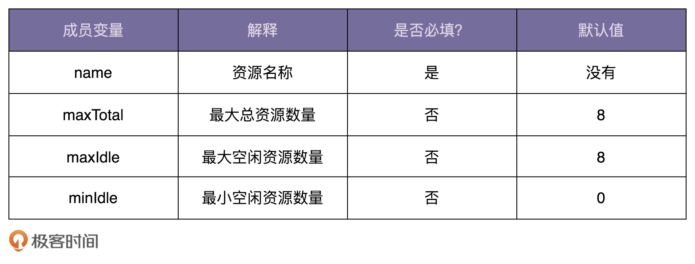

[toc]

## 46 | 建造者模式：详解构造函数、set 方法、建造者模式三种对创建方式

-   今天，我们再来学习另外一个比较常用的创建型设计模式，Builder 模式（**建造者模式**或**构建者模式**），也叫**生成器模式**。
-   我们们先来考虑这么几个问题：
    1.  直接使用构造函数或者配合 set 方法就能创建对象，为什么还需要建造者模式来创建呢？
    2.  建造者模式和工厂模式都可以创建对象，那它们两个的区别在哪里？

### 为什么需要建造者模式？

-   平时开发中，创建一个对象最常用的方式是，使用 new 关键字调用类的构造函数来完成。那什么情况下，这种方式就不适用了，就需要采用建造者模式来创建对象呢？

-   例：我们需要定义一个资源池配置类 ResourcePoolConfig，有下面几个成员变量。

    -   

-   最常见、最容易的实现的思路代码如下：

    -   ```java
        
        public class ResourcePoolConfig {
          private static final int DEFAULT_MAX_TOTAL = 8;
          private static final int DEFAULT_MAX_IDLE = 8;
          private static final int DEFAULT_MIN_IDLE = 0;
        
          private String name;
          private int maxTotal = DEFAULT_MAX_TOTAL;
          private int maxIdle = DEFAULT_MAX_IDLE;
          private int minIdle = DEFAULT_MIN_IDLE;
        
          public ResourcePoolConfig(String name, Integer maxTotal, Integer maxIdle, Integer minIdle) {
            if (StringUtils.isBlank(name)) {
              throw new IllegalArgumentException("name should not be empty.");
            }
            this.name = name;
        
            if (maxTotal != null) {
              if (maxTotal <= 0) {
                throw new IllegalArgumentException("maxTotal should be positive.");
              }
              this.maxTotal = maxTotal;
            }
        
            if (maxIdle != null) {
              if (maxIdle < 0) {
                throw new IllegalArgumentException("maxIdle should not be negative.");
              }
              this.maxIdle = maxIdle;
            }
        
            if (minIdle != null) {
              if (minIdle < 0) {
                throw new IllegalArgumentException("minIdle should not be negative.");
              }
              this.minIdle = minIdle;
            }
          }
          //...省略getter方法...
        }
        ```

    -   现在 ResourcePoolConfig 只有 4 个配置项，如果可配置项逐渐增多，变成 8个、16个，甚至更多。

    -   如果沿用现在的设计思路，那构造函数的参数列表就会变得很长，代码的可读性和易用性上都会变差。

    -   ```java
        
        // 参数太多，导致可读性差、参数可能传递错误
        ResourcePoolConfig config = new ResourcePoolConfig("dbconnectionpool", 16, null, 8, null, false , true, 10, 20，false， true);
        ```

-   解决如上问题的办法：使用 set() 函数来给成员变量赋值，以替代冗长的构造函数。

    -   其中，name 是必填的，我们把它放在构造函数中设置，强制创建对象的时候就要填写。

    -   其他几个都是不必填的，所以我们通过 set() 函数来设置，让使用者自主选择填写或不填写。

    -   ```java
        
        public class ResourcePoolConfig {
          private static final int DEFAULT_MAX_TOTAL = 8;
          private static final int DEFAULT_MAX_IDLE = 8;
          private static final int DEFAULT_MIN_IDLE = 0;
        
          private String name;
          private int maxTotal = DEFAULT_MAX_TOTAL;
          private int maxIdle = DEFAULT_MAX_IDLE;
          private int minIdle = DEFAULT_MIN_IDLE;
          
          public ResourcePoolConfig(String name) {
            if (StringUtils.isBlank(name)) {
              throw new IllegalArgumentException("name should not be empty.");
            }
            this.name = name;
          }
        
          public void setMaxTotal(int maxTotal) {
            if (maxTotal <= 0) {
              throw new IllegalArgumentException("maxTotal should be positive.");
            }
            this.maxTotal = maxTotal;
          }
        
          public void setMaxIdle(int maxIdle) {
            if (maxIdle < 0) {
              throw new IllegalArgumentException("maxIdle should not be negative.");
            }
            this.maxIdle = maxIdle;
          }
        
          public void setMinIdle(int minIdle) {
            if (minIdle < 0) {
              throw new IllegalArgumentException("minIdle should not be negative.");
            }
            this.minIdle = minIdle;
          }
          //...省略getter方法...
        }
        ```

    -   接下来，我们来看新的 ResourcePoolConfig 类该如何使用。示例代码如下：

    -   ```java
        
        // ResourcePoolConfig使用举例
        ResourcePoolConfig config = new ResourcePoolConfig("dbconnectionpool");
        config.setMaxTotal(16);
        config.setMaxIdle(8);
        ```

-   继续思考下而三个问题，看现在的设计思路是否还能满足需求？

    1.  如果必填项很多，把这些必填项放到构造函数中设置，那构造函数就又会出现参数列表很长的问题。如果我们把必填项也通过 set() 方法设置，那校验这些必填项是否已经填写的逻辑就无处安放了。
    2.  假如，配置项之间有定和依赖关系。或配置项之间有一定的约束条件。如果我们继续使用现在的设计思路，那这些配置项之间的依赖关系或约束条件的检验逻辑就无处安放了。
    3.  如果我们希望 ResourcePoolConfig 类对象是不可变对象，也就是说，对象在创建好后就不能再修改内部属性值。要实现这个功能，我们就不能 ResourcePoolConfig 类中暴露 set() 方法。

-   为了解决这些问题，就需要使用建造者模式。

    -   **我们把检验逻辑放置在 Builder 类中，先创建建造者，并且通过 set() 方法设置建造者的变量值，然后在使用 build() 方法真正创建对象之前，做集中的检验，校验通过之后才会创建对象。**

    -   此外，**我们把 ResourcePoolConfig 的构造函数改为 private 私有权限，只能通过建造者来创建 ResourcePoolConfig 类对象。并且 ResourcePoolConfig 没有提供任何 set() 方法，这样创建出来的对象就是不可变对象了。**

    -   代码如下：

    -   ```java
        
        public class ResourcePoolConfig {
          private String name;
          private int maxTotal;
          private int maxIdle;
          private int minIdle;
        
          private ResourcePoolConfig(Builder builder) {
            this.name = builder.name;
            this.maxTotal = builder.maxTotal;
            this.maxIdle = builder.maxIdle;
            this.minIdle = builder.minIdle;
          }
          //...省略getter方法...
        
          //我们将Builder类被设计成了ResourcePoolConfig的内部类。
          //我们也可以将Builder类设计成独立的非内部类ResourcePoolConfigBuilder。
          public static class Builder {
            private static final int DEFAULT_MAX_TOTAL = 8;
            private static final int DEFAULT_MAX_IDLE = 8;
            private static final int DEFAULT_MIN_IDLE = 0;
        
            private String name;
            private int maxTotal = DEFAULT_MAX_TOTAL;
            private int maxIdle = DEFAULT_MAX_IDLE;
            private int minIdle = DEFAULT_MIN_IDLE;
        
            public ResourcePoolConfig build() {
              // 校验逻辑放到这里来做，包括必填项校验、依赖关系校验、约束条件校验等
              if (StringUtils.isBlank(name)) {
                throw new IllegalArgumentException("...");
              }
              if (maxIdle > maxTotal) {
                throw new IllegalArgumentException("...");
              }
              if (minIdle > maxTotal || minIdle > maxIdle) {
                throw new IllegalArgumentException("...");
              }
        
              return new ResourcePoolConfig(this);
            }
        
            public Builder setName(String name) {
              if (StringUtils.isBlank(name)) {
                throw new IllegalArgumentException("...");
              }
              this.name = name;
              return this;
            }
        
            public Builder setMaxTotal(int maxTotal) {
              if (maxTotal <= 0) {
                throw new IllegalArgumentException("...");
              }
              this.maxTotal = maxTotal;
              return this;
            }
        
            public Builder setMaxIdle(int maxIdle) {
              if (maxIdle < 0) {
                throw new IllegalArgumentException("...");
              }
              this.maxIdle = maxIdle;
              return this;
            }
        
            public Builder setMinIdle(int minIdle) {
              if (minIdle < 0) {
                throw new IllegalArgumentException("...");
              }
              this.minIdle = minIdle;
              return this;
            }
          }
        }
        
        // 这段代码会抛出IllegalArgumentException，因为minIdle>maxIdle
        ResourcePoolConfig config = new ResourcePoolConfig.Builder()
                .setName("dbconnectionpool")
                .setMaxTotal(16)
                .setMaxIdle(10)
                .setMinIdle(12)
                .build();
        ```

-   使用建造者模式创建对象，还能避免对象存在无效状态。如下例：我们定义了一个长方形类。

    -   ```java
        
        Rectangle r = new Rectange(); // r is invalid
        r.setWidth(2); // r is invalid
        r.setHeight(3); // r is valid
        ```

    -   为了避免这种无效状态的存在，我们就需要使用构造函数一次性初始化所有成员变量。如果构造函数过多，我们就需要考虑使用建造者模式，先设置建造者的变量，然后再一次性地创建对象，让对象一直处于有效状态。

### 与工厂模式有何区别？

-   工厂模式是用来创建不同，但相关类型的对象（继承同一父类或接口的一组子类），由给定的参数来决定创建哪种类型的对象。
-   建造者模式是用来创建一种类型的复杂对象，通过设置不同的可选参数，“定制化”地创建不同的对象。
-   实际上，对于工厂、建造者模式，我们需要知道的是，**每个模式为什么这么设计，能解决什么问题**。只有了解了这些最本质的东西，我们才能不生搬硬套，才能灵活应用，甚至可以混用各种模式创造出新的模式，来解决特定场景的问题。

### 重点回顾

-   建造者模式原理和实现比较简单，重点是掌握应用场景，避免过度使用。
-   如果一个类中有很多属性，为了避免构造函数的参数列表过长，影响代码的可读性和易用性，我们可以通过构造函数配合 set() 方法来解决。但，如果存在下面情况中的一种，我们就需要考虑使用建造者模式了。
    1.  如果必填属性很多，把这些必填项放到构造函数中设置，那构造函数就又会出现参数列表很长的问题。如果我们把必填项也通过 set() 方法设置，那校验这些必填项是否已经填写的逻辑就无处安放了。
    2.  如果类的属性之间有一定的依赖关系、一定的约束条件。如果我们继续使用构造函数配合 set() 方法的设计思路中，那这些配置项之间的依赖关系或约束条件的检验逻辑就无处安放了。
    3.  如果我们希望类对象是不可变对象，也就是说，对象在创建好后就不能再修改内部属性值。要实现这个功能，我们就不能在类中暴露 set() 方法。
-   此外，今天，我们还对比了工厂模式和建造者模式的区别。
    -   工厂模式是用来创建不同但是相关类型的对象（继承同一父类或接口的一组子类），由给定的参数来决定创建哪种类型的对象。
    -   建造者模式是用来创建一个类型的复杂对象，可以通过设计不同的可选参数，“定制化”地创建不同的对象。

