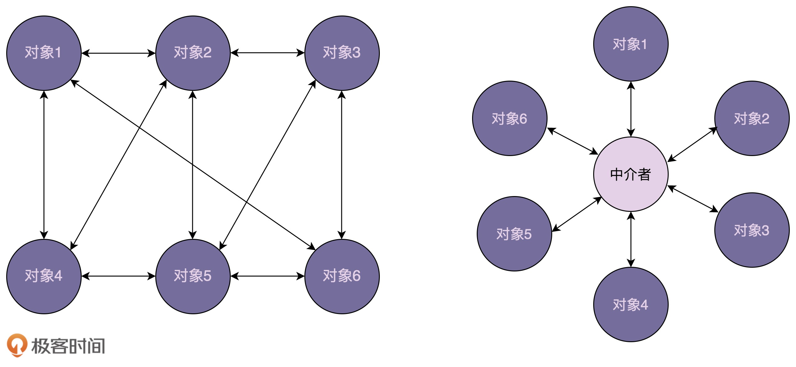

[toc]

## 73 | 中介模式：什么时候用中介模式？什么时候用观察者模式？

### 中介模式的原理和实现

-   中介模式

    -   中介模式定义了一个单独的（中介）对象，来封装一组对象之间的交互。将这组对象之间的交互委派给与与中介对象交互，来避免对象之间的直接交互。 -- GoF 《设计模式》

-   对象交互关系的对比图，右边的交互图是利用中介模式。

    -   

-   示例：

    -   按照中介模式，各个控件只跟中介对象交互，中介对象负责所有业务逻辑的处理。

    -   ```java
        
        public interface Mediator {
          void handleEvent(Component component, String event);
        }
        
        public class LandingPageDialog implements Mediator {
          private Button loginButton;
          private Button regButton;
          private Selection selection;
          private Input usernameInput;
          private Input passwordInput;
          private Input repeatedPswdInput;
          private Text hintText;
        
          @Override
          public void handleEvent(Component component, String event) {
            if (component.equals(loginButton)) {
              String username = usernameInput.text();
              String password = passwordInput.text();
              //校验数据...
              //做业务处理...
            } else if (component.equals(regButton)) {
              //获取usernameInput、passwordInput、repeatedPswdInput数据...
              //校验数据...
              //做业务处理...
            } else if (component.equals(selection)) {
              String selectedItem = selection.select();
              if (selectedItem.equals("login")) {
                usernameInput.show();
                passwordInput.show();
                repeatedPswdInput.hide();
                hintText.hide();
                //...省略其他代码
              } else if (selectedItem.equals("register")) {
                //....
              }
            }
          }
        }
        
        public class UIControl {
          private static final String LOGIN_BTN_ID = "login_btn";
          private static final String REG_BTN_ID = "reg_btn";
          private static final String USERNAME_INPUT_ID = "username_input";
          private static final String PASSWORD_INPUT_ID = "pswd_input";
          private static final String REPEATED_PASSWORD_INPUT_ID = "repeated_pswd_input";
          private static final String HINT_TEXT_ID = "hint_text";
          private static final String SELECTION_ID = "selection";
        
          public static void main(String[] args) {
            Button loginButton = (Button)findViewById(LOGIN_BTN_ID);
            Button regButton = (Button)findViewById(REG_BTN_ID);
            Input usernameInput = (Input)findViewById(USERNAME_INPUT_ID);
            Input passwordInput = (Input)findViewById(PASSWORD_INPUT_ID);
            Input repeatedPswdInput = (Input)findViewById(REPEATED_PASSWORD_INPUT_ID);
            Text hintText = (Text)findViewById(HINT_TEXT_ID);
            Selection selection = (Selection)findViewById(SELECTION_ID);
        
            Mediator dialog = new LandingPageDialog();
            dialog.setLoginButton(loginButton);
            dialog.setRegButton(regButton);
            dialog.setUsernameInput(usernameInput);
            dialog.setPasswordInput(passwordInput);
            dialog.setRepeatedPswdInput(repeatedPswdInput);
            dialog.setHintText(hintText);
            dialog.setSelection(selection);
        
            loginButton.setOnClickListener(new OnClickListener() {
              @Override
              public void onClick(View v) {
                dialog.handleEvent(loginButton, "click");
              }
            });
        
            regButton.setOnClickListener(new OnClickListener() {
              @Override
              public void onClick(View v) {
                dialog.handleEvent(regButton, "click");
              }
            });
        
            //....
          }
        }
        ```

-   中介模式好处：

    -   简化了控件之间的交互。

-   坏处

    -   中介类有可能会变成大而复杂的“上帝类”（God Class）。

### 中介模式 VS 观察者模式

-   在**观察者模式**中，尽管一个参与者既可以是观察者，同时也可以是被观察者。但，大部分情况下，交互关系往往都是单向的，一个参与者要么是观察者，要么是被观察者，不会兼具两种身份。也就是说，在观察者模式的应用场景中参考者之间的关系比较有条理。
-   在**中介模式**中，可能会产生大而复杂的上帝类。此外，中介模式只可以利用中介类，通过先后调用不同参与者的方法，来实现顺序的控制。

### 重点回顾

-   中介模式的设计思想跟中间层很像，通过引入中介这个中间层，**将一组对象之间的交互关系从多对多转换为一对多**。降低了代码的复杂度，提高了代码的可读性和可维护性。
-   观察者模式和中介模式都是为了实现参与者间的解耦，简化交互关系。
-   两者不同在于应用场景上：
    -   观察者模式的应用场景中，**参与者之间的交互比较有条理，一般都是单向的，一个参与者只有一个身份**，要么是观察者，要么是被观察者。
    -   中介模式中，**参考者之间的交互关系错综复杂**，既可以是消息发送者、也可以是消息接收者。