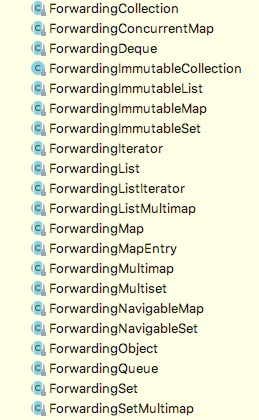

[toc]

## 82 | 开源实战三（中）：剖析 Google Guava 中用到的几种设计模式

-   今天，我们来学习一下，Google Guava 中用到的几种设计模式：Builder 模式、Wrapper 模式，及 Immutable 模式。

### Builder 模式在 Guava 中的应用

-   使用 Google Guava 来构建内在缓存非常简单，如下：

    -   ```java
        
        public class CacheDemo {
          public static void main(String[] args) {
            Cache<String, String> cache = CacheBuilder.newBuilder()
                    .initialCapacity(100)
                    .maximumSize(1000)
                    .expireAfterWrite(10, TimeUnit.MINUTES)
                    .build();
        
            cache.put("key1", "value1");
            String value = cache.getIfPresent("key1");
            System.out.println(value);
          }
        }
        ```

-   如上代码中，为什么要由 Builder 业来创建 Cache 对象呢？

    -   为了避免构造函数的参数列表过长、不同的构造函数过多。

-   CacheBuilder 类中的 build() 函数如下：

    -   ```java
        
        public <K1 extends K, V1 extends V> Cache<K1, V1> build() {
          this.checkWeightWithWeigher();
          this.checkNonLoadingCache();
          return new LocalManualCache(this);
        }
        
        private void checkNonLoadingCache() {
          Preconditions.checkState(this.refreshNanos == -1L, "refreshAfterWrite requires a LoadingCache");
        }
        
        private void checkWeightWithWeigher() {
          if (this.weigher == null) {
            Preconditions.checkState(this.maximumWeight == -1L, "maximumWeight requires weigher");
          } else if (this.strictParsing) {
            Preconditions.checkState(this.maximumWeight != -1L, "weigher requires maximumWeight");
          } else if (this.maximumWeight == -1L) {
            logger.log(Level.WARNING, "ignoring weigher specified without maximumWeight");
          }
        
        }
        ```

-   必须使用 Builder 模式的主要原因是，**在真正构造 Cache 对象的时候，我们必须做一些必要的参数校验**，也就是 buil() 函数中要前两行代码要做的工作。

### Wrapper 模式在 Guava 中的应用

-   在 collection 包路径下，有一组以 Forwarding 开关命名的类。

    -   

-   摘抄其中的 ForwardingCollection 中的部分代码如下：

    -   ```java
        @GwtCompatible
        public abstract class ForwardingCollection<E> extends ForwardingObject implements Collection<E> {
          protected ForwardingCollection() {
          }
        
          protected abstract Collection<E> delegate();
        
          public Iterator<E> iterator() {
            return this.delegate().iterator();
          }
        
          public int size() {
            return this.delegate().size();
          }
        
          @CanIgnoreReturnValue
          public boolean removeAll(Collection<?> collection) {
            return this.delegate().removeAll(collection);
          }
        
          public boolean isEmpty() {
            return this.delegate().isEmpty();
          }
        
          public boolean contains(Object object) {
            return this.delegate().contains(object);
          }
        
          @CanIgnoreReturnValue
          public boolean add(E element) {
            return this.delegate().add(element);
          }
        
          @CanIgnoreReturnValue
          public boolean remove(Object object) {
            return this.delegate().remove(object);
          }
        
          public boolean containsAll(Collection<?> collection) {
            return this.delegate().containsAll(collection);
          }
        
          @CanIgnoreReturnValue
          public boolean addAll(Collection<? extends E> collection) {
            return this.delegate().addAll(collection);
          }
        
          @CanIgnoreReturnValue
          public boolean retainAll(Collection<?> collection) {
            return this.delegate().retainAll(collection);
          }
        
          public void clear() {
            this.delegate().clear();
          }
        
          public Object[] toArray() {
            return this.delegate().toArray();
          }
          
          //...省略部分代码...
        }
        ```

-   ForwardingCollection 用法示例

    -   ```java
        public class AddLoggingCollection<E> extends ForwardingCollection<E> {
          private static final Logger logger = LoggerFactory.getLogger(AddLoggingCollection.class);
          private Collection<E> originalCollection;
        
          public AddLoggingCollection(Collection<E> originalCollection) {
            this.originalCollection = originalCollection;
          }
        
          @Override
          protected Collection delegate() {
            return this.originalCollection;
          }
        
          @Override
          public boolean add(E element) {
            logger.info("Add element: " + element);
            return this.delegate().add(element);
          }
        
          @Override
          public boolean addAll(Collection<? extends E> collection) {
            logger.info("Size of elements to add: " + collection.size());
            return this.delegate().addAll(collection);
          }
        
        }
        ```

-   Forwarding 类的作用：

    -   AddLoggingCollection 是基于代码模式实现的一个代理类，它在原始的 Collection 类的基础上，针对 add 相关的操作，添加记录了日志的功能。

-   为了简化 Wrapper 模式的代码实现，Guava 提供一系列缺省的 Forwarding 类。**用户在实现自己的 Wrapper 类的时候，基于缺省的 Forwarding 类来扩展，就可以只实现自己关心的方法，其他不关心的方法使用缺省 Forwarding 类的实现**，就像 AddLoggingCollection 类实现那样。

### Immutable 模式在 Guava 中的应用

-   一个对象的状态在对象创建后就不再改变，这就是所谓的**不变模式**。其中涉及的类就是不变类，对象就是不变对象。
-   不变模式可以分为两类：
    -   一类是普通不变模式。
    -   另一类是深度不变模式。

### 重点回顾

-   今天，我们学习 Google Guava 中用到的几个设计模式：Builder 模式、Wrapper 模式、Immutable 模式。
-   **学习设计模式能让你更好的阅读源码、理解源码**。

