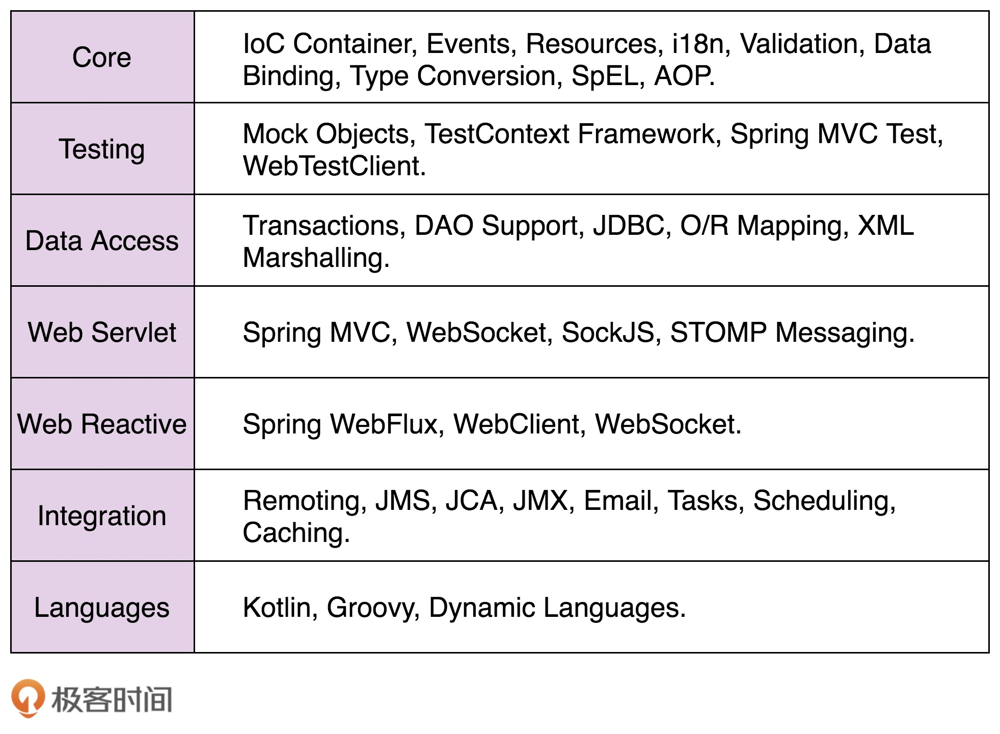
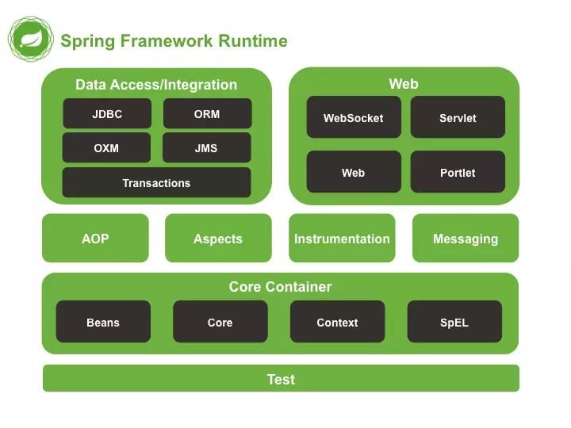

[toc]

## 84 | 开源实战四（上）：剖析 Spring 框架中蕴含的经典设计思想或原则

1.  Spring 框架内容比较多，我分三部分来讲解：
    -   第一部分，我们讲解 Spring 框架中蕴含的**经典设计思想或原则**。
    -   第二部分，我们讲解 Spring 框架中**用来支持扩展的两种设计模式**。
    -   第三部分，我们总结罗列 Spring 框架中用到的其他十几种**设计模式**。
2.  今天，我们来讲第一部分：Spring 框架中蕴含的**经典设计思想或原则**

### Spring 框架简单介绍

-   Spring 框架是 Spring Framework 基础框架。Spring Framework 是整个 Spring 生态的基石。
-   

### 从 Spring 看框架的作用

-   解耦业务和非业务开发、让程序员聚焦在业务开发上、隐藏复杂实现细节、降低开发难度、减少代码 bug。
-   实现代码复用、节省开发时间。
-   规范化标准化项目开发、降低学习和维护成本等。
-   总结一句话：**简化开发**。

### Spring 框架蕴含的设计思想

-   今天我们剖析一下 Spring 框架背后的一些经典的设计思想（或开发技巧）。这些设计思想并非 Spring 独有，都比较通用，能借鉴应用在很多通用功能模块的设计开发中。

#### 1. 约定优于配置

-   如何简化配置呢？一般有两种方法：
    -   一种是，基于注解。
    -   另一种是，基于约定。
-   **基于注解**的配置方式，我们在指定类上使用的注解，来替代集中的 XML 配置。
-   **基于约定**的配置方式，通过约定的代码结构或者命名来减少配置。说白点，就是提供配置的默认值，优先使用默认值。
-   约定优于配置，很好地体现了“**二八法则**”。80% 的配置使用默认配置，20% 的配置必须用户显式去设置。

#### 2. 低侵入、松耦合

-   所谓**低侵入**指的是，框架代码很少耦合在业务代码中。
-   低侵入，是 Spring 框架遵循的一个非常重要的设计思想。

#### 3. 模块化、轻量级

-   Spring Framework 的模块和分层介绍图：
    -   
-   Spring 在分层、模块化方面做得很好。
    -   每个模块都只负责一个相对独立的功能。
    -   模块间的关系，仅有上层对下层的依赖关系，而同层间以及下层对上层，几乎没有依赖和耦合。
    -   每个模块都非常轻量级，都可以单独拿来使用。

#### 4. 再封装、再抽象

-   Srping 还对市面上主流的中间件、系统的访问类库，做了进一步的封装和抽象，提供了更高层次、更统一的访问接口。

### 重点回顾

1.  借助 Spring 框架，我们总结了框架的作用： -- **简化开发**

    -   解耦业务和非业务开发、让程序员聚焦在业务开发上、隐藏复杂实现细节、降低开发难度、减少代码 bug。
    -   实现代码复用、节省开发时间。
    -   规范化标准化项目开发、降低学习和维护成本等。

2.  我们还重点讲解了 Spring 背后蕴含的一些经典的设计思想，主要有：

    -   约定优于配置
    -   低侵入、松耦合
    -   模块化、轻量级
    -   再封装、再抽象

    